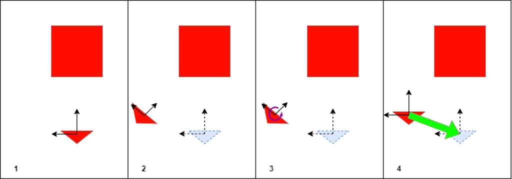

# Rotation

This document describes the rotations that are generated by the blender rendering script. The simplest technical description of the rotation we are asking competitors to provide for us is as follows: We are asking for the right-handed passive quaternion rotation with Hamiltonian composition. In this document, we provide the following sections: 

- [Layman-terms definition](#layman-definition)
- [Quaternion Definition](#quaternion-definition)
- [Passive Rotations](#passive-rotation)
- [Right Handed Quaternion](#right-handed-quaternion)

## Layman Definition

The simplest definition for the described rotation is that we are asking competitors to provide us with the rotation that will get the **current** orientation of the chaser spacecraft back to the **base** orientation of the chaser spacecraft. In blender, if the rotation is applied to the current orientation of the chaser spacecraft, and then the translation to get it back to the original location is also applied, you should end up with a rendering of the base image. This is shown in a 2D representation below. The target spacecraft is shown as the rectangle, and the chaser spacecraft is shown as the triangle. The reference frame is defined **at the chaser spacecraft**. It is assumed that all rotations / translations are applied to the chaser spacecraft, as shown in the second panel. We are asking competitors to provide the rotation that would reorient the chaser spacecraft ot the original orientation (shown in panel 3), and **then** to apply the translation back to the original location (shown in panel 4).

## Quaternion Definition

There are various different ways to represent rotations. We ask that competitors provide these rotations as [quaternions](https://en.wikipedia.org/wiki/Quaternion). Quaternions are a 4D representation of rotation, used as a replacement to [Euler angles](https://en.wikipedia.org/wiki/Euler_angles) in order to avoid [gimbal lock](https://en.wikipedia.org/wiki/Gimbal_lock) and ensure well-defined rotations. There is a section in [this](./Rotations.pdf) document that describes the use of Quaternions.

## Passive Rotation
Active vs. Passive rotations refers to the composition rule used when applying a rotation. It mostly applies to compositions of rotations, and whether the observer stays fixed in space when the body that is being transformed rotates (active) or the observer experiences the rotation of the spacecraft, and so sees the reference frame rotating rather than the spacecraft (passive). For further reading on this subject, we would like to reference [this](./Rotations.pdf) material.

In the context of a single rotation (as with this competition), applying an active rotation rather than a passive rotation will just produce the inverse rotation from the desired one (an easily amendable mistake). We would still like to specify that we ask competitors to provide us with the **passive** rotation, that is, the rotation that will take the current reference frame back to the original (unit quaternion) reference frame.

## Right Handed Quaternion

The "handedness" of a quaternion is more of an artifact as to in which *direction* a quaternion is applied when rotating. Regardless, having this well-defined is still important to ensure that the format of submitted quaternions matches the truth representation. For this competition, we expect competitors to submit **right handed** quaternions. Left handed quaternions will just have the _w_ component of the quaternion negated. This is described in detail in [this](./Rotations.pdf) document, in the section titled "Shuster's Convention".